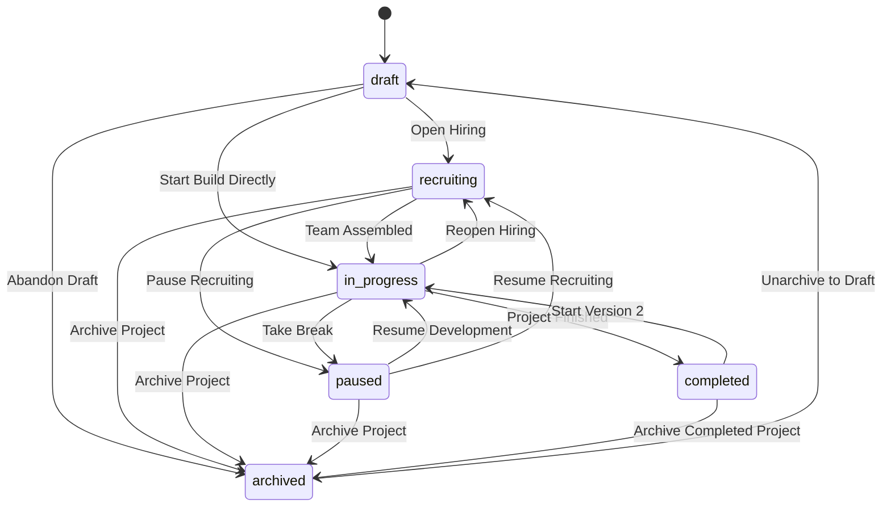

# Project Status Transition Specification (#232)

## Overview

DevLink enforces strict project status lifecycle transitions to maintain data integrity and prevent invalid operational states (e.g. attempting to move directly from `Archived` to `Recruiting`).

---

## Project Statuses

| Status | Description |
| :--- | :--- |
| `draft` | Initial draft status. Project details are being prepared prior to recruitment or active development. |
| `recruiting` | Open status where project owners actively recruit team members, contributors, or mentors. |
| `in_progress` | Active development phase where the team actively builds the project. |
| `paused` | Project development and recruitment are temporarily placed on hold. |
| `completed` | Project development is finished. MVP/Production release reached. |
| `archived` | Project is inactive or deprecated. Archived projects cannot directly re-enter recruitment. |

---

## Allowed Status Transitions Matrix

| From (`Current`) | Allowed To (`Target`) | Rejected Transitions (HTTP 400 Bad Request) |
| :--- | :--- | :--- |
| **`draft`** | `recruiting`, `in_progress`, `archived` | `completed`, `paused` |
| **`recruiting`** | `in_progress`, `paused`, `archived` | `draft`, `completed` |
| **`in_progress`** | `completed`, `paused`, `recruiting`, `archived` | `draft` |
| **`paused`** | `in_progress`, `recruiting`, `archived` | `draft`, `completed` |
| **`completed`** | `archived`, `in_progress` | `draft`, `recruiting`, `paused` |
| **`archived`** | `draft` | `recruiting`, `in_progress`, `completed`, `paused` |

*Note: Self-transitions (e.g. `recruiting` ➔ `recruiting`) are valid no-ops.*

---

## API Error Response for Invalid Transitions

When a client sends an invalid project status transition request (e.g., `PUT /api/projects/{project_id}` with `{"status": "recruiting"}` on an archived project), the server responds with **`400 Bad Request`**:

```json
{
  "detail": "Invalid project status transition from 'archived' to 'recruiting'. Allowed target status(es) from 'archived': ['draft']"
}
```

---

## Lifecycle Example Workflow


